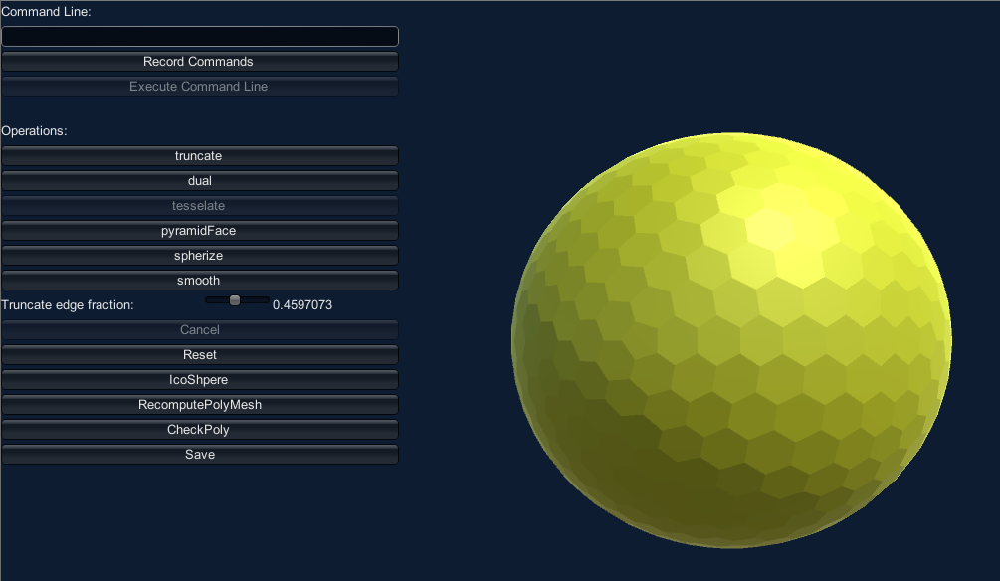

# Polyhedron Generation Tool for unity

Provides function to generate simple, and procedurally modify existing polyhedron shapes.
Can store these shapes as both Unity Mesh objects and as custom face and neighbor based scriptable Object.
Operations include geometric truncation, dual, spherize, and for triangluar faces- tessellation.

---

## Dependencies

Required Packages

   ##### UniTask by Cysharp:
   https://github.com/Cysharp/UniTask.git?path=src/UniTask/Assets/Plugins/UniTask
   	
   ##### EyE.CommonAssetTypes:
   https://github.com/glurth/CommonAssetTypes.git

## Installation

In the unity editor, package manager window, click to add a package from a git url. 
First add the dependencies specified above, then add: https://github.com/glurth/UIPrefabGenerator.git

---

## Usage

One may use the polyhedron files and associated sample asset files directly, or one may use the interface in the main scene, to generate custom polyhedra

The scene provides an interface that will allow the user to perform operations on a "starting polyhedron".  Currently, the user will need to specify the starting object, before running the scene, in the "Maker" scene object's inspector.  User may specify a starting Polyhedron asset, or a Mesh asset that the system will attempt to generate a polyhedron from (or neither to use the default starting point of an icosahedron).

---

## File structure

#### RunTime:
	
- Contains the code files and class definitions.  

#### SampleAssets:
- Contains a bunch of pre-generated unity and polyhedron assets.  Each Polyhedron contains the data that defines a polyhedron.  It MAY also store this information in two other forms, for efficiency: a regular unity mesh, and a FacesAndNeighbors asset which proves usful for path finding and maps.
- Two materials with their own custom shaders, and a test texture.  These materials can been tuned to show how both UV0 and UV1 are mapped.
- The main scene with an interface to create new polyhedrons.
- The polyhedrons contain in here started with an icosahedron and used multiple triangular face tessellation operations, and a final dual operation when generated.
- The TruncPyramidFolder contains polyhedrons generated, starting with an icosahedron, using the truncate corner, and pyramid face operations in an alternating sequence.

---

## Contributions

Contributions, issues, and feature requests are welcome! Please submit them via the GitHub repository. Note: Due to licensing, contributions can only be included with explicit written permission from the copyright holder.

---

## Licensing

This package is licensed under the EyE Dual-Licensing Agreement.

It provides free, perpetual use for indie developers and non-commercial projects whose teams had Total Gross Receipts under $100,000 USD in the previous fiscal year.

Organizations exceeding this threshold must obtain a Perpetual Commercial License (PCL) for each named commercial project.

Please review the full terms in [LICENSE.md](LICENSE.md) before commercial use.